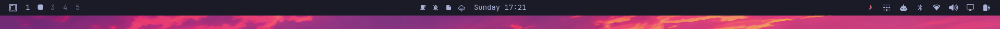
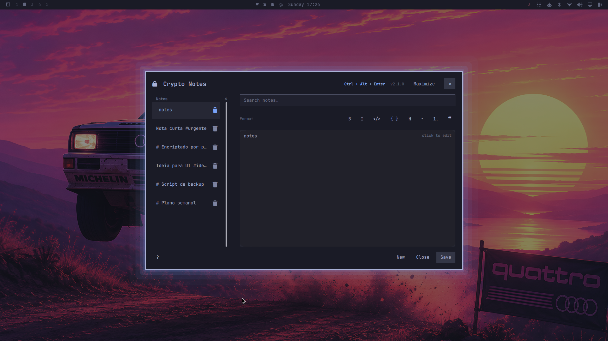
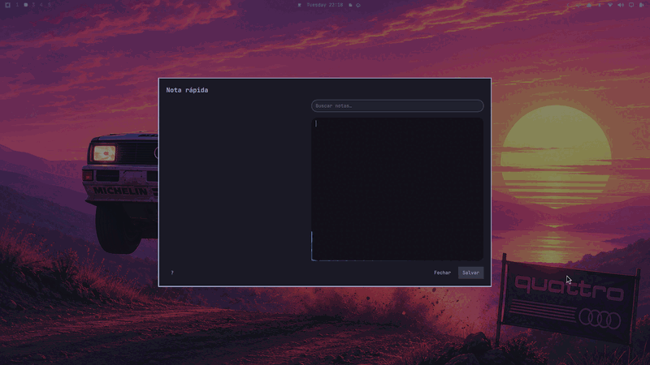
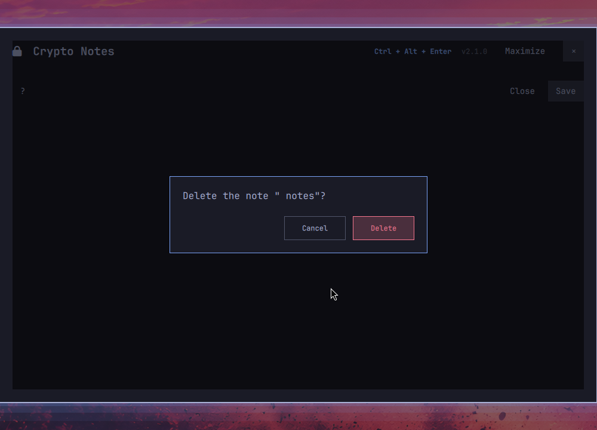
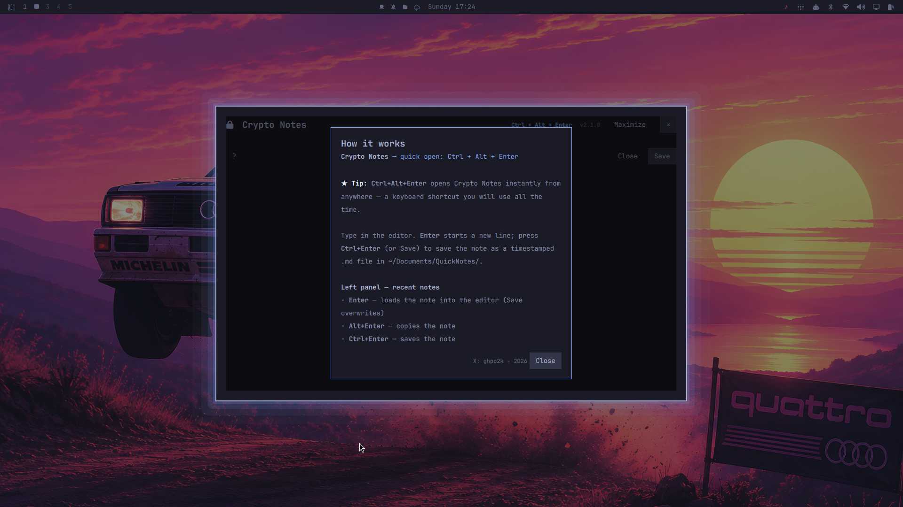

# ghpo.quicknote

Quick note for the Omarchy bar. Adds a button next to the clock that opens a
dialog for a fast note; pressing Enter (or Salvar) saves it to
`~/Documents/QuickNotes/` as a timestamped markdown file. Esc (or Fechar)
discards.

The dialog also shows your recent notes, lets you search them, and reads
`#tags` from note text so you can filter by tag.

## Screenshots

The note button lives in the bar, right next to the clock:



Click it to open the dialog — recent notes on the left, search + editor on the
right:



The editor has an animated neon border:



Delete asks for confirmation:



And the `?` button opens an in-dialog guide:



## Install

```bash
omarchy plugin add https://github.com/ghpo/ghpo.quicknote.git --enable
```

or, from a local checkout:

```bash
omarchy plugin add /path/to/ghpo.quicknote --enable
```

Enable it with a placement if you want it elsewhere:

```bash
omarchy plugin enable ghpo.quicknote --section center --after omarchy.clock
```

## Usage

- Click the note icon in the bar (or press `Ctrl+Alt+Enter` — add that
  binding yourself, it is user config, not part of the plugin):

  ```lua
  -- ~/.config/hypr/bindings.lua
  o.bind("CTRL + ALT + RETURN", "Quick note", "omarchy-shell shell toggle ghpo.quicknote")
  ```

- Type the note. `Enter` saves, `Shift+Enter` inserts a newline, `Esc` closes
  without saving.

- The left pane lists recent notes (newest first). Click one to load it into
  the editor and edit it; Salvar overwrites that file. Keyboard: `↑`/`↓`
  navigate, `Enter` loads, `Alt+Enter` copies the note, `Ctrl+Enter` opens it
  in your editor, `Delete` asks to delete the selected note.

- Delete a note with the trash icon on its row (or `Delete` in the list); a
  confirmation dialog must be confirmed. Deleting a note that is being edited
  resets the editor to a fresh note.

- Type in the search box to filter notes by text or by `#tag` (tags are
  detected automatically from `#word` tokens in note text). Click a tag in the
  list to filter by it. `Esc` in the search box clears it.

- The `?` button in the bottom bar opens an in-dialog help overlay explaining
  the shortcuts and how `#tag` categorization works, with an embedded MIDI
  (Darude - Sandstorm) synthesized and played via timidity while it is open.

## Settings

Per-widget settings in `shell.json` (the widget's layout entry):

| Key       | Default                    | Description                     |
|-----------|----------------------------|---------------------------------|
| `icon`    | `󰎚` (note)                 | Glyph shown on the bar button   |
| `notesDir`| `~/Documents/QuickNotes`   | Where the note files are saved  |

Example:

```json
{ "id": "ghpo.quicknote", "icon": "󰎚", "notesDir": "~/Documents/QuickNotes" }
```

## Layout

- `manifest.json` — plugin manifest (bar-widget + overlay)
- `QuickNoteButton.qml` — the bar button
- `QuickNoteFlow.qml` — the note dialog overlay (editor + recent-notes list)
- `quicknote.sh` — wrapper that builds and execs the storage helper
- `save-note.sh` — argv-compatible wrapper (pipes the note to stdin)
- `quicknote-helper.c` — audited C storage helper: fd-based no-follow access, bounded IO, JSON output
- `LICENSE` — MIT
- `preview.png` — marketplace preview image (the note dialog)
- `demo.gif` — animated demo of the neon-border editor
- `screenshot-icon.png` — bar icon next to the clock
- `screenshot-help.png` — the help overlay
- `screenshot-delete.png` — the delete confirmation

The button summons the dialog through `omarchy-shell shell summon
ghpo.quicknote`, passing the configured `notesDir` in the payload.

## License

MIT. See [LICENSE](LICENSE).
